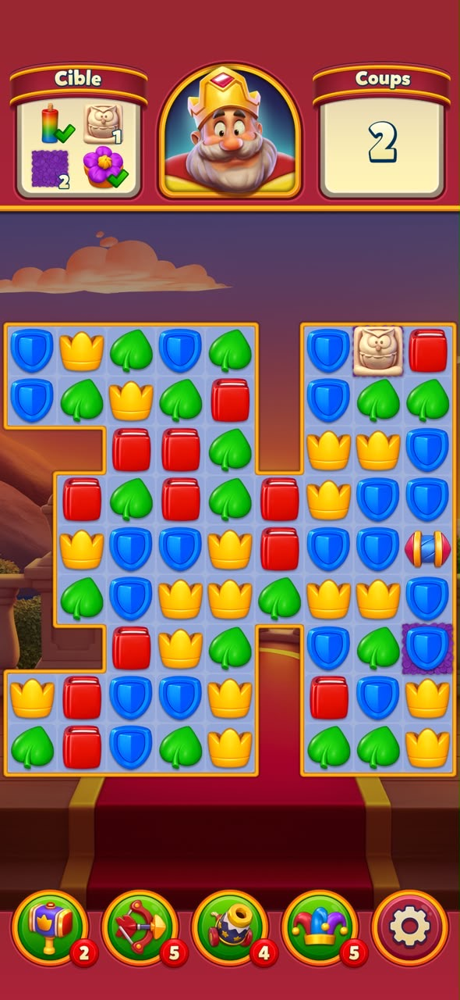

# Match Mboko 👑

Jeu de match-3 web inspiré de Royal Match, construit avec Next.js 16 + Framer Motion. Responsive mobile-first, jouable au doigt (swipe) ou à la souris (clic/glisser).



---

## Fonctionnalités

- **Grille irrégulière** — forme personnalisable via un masque 8×8 (`GRID_MASK`)
- **Match-3 complet** — détection horizontale et verticale, alignements de 3, 4 ou 5+
- **Cascade infinie** — après chaque chute, nouvelles correspondances détectées automatiquement
- **Combo multiplier** — le score augmente à chaque cascade enchaînée
- **Swipe tactile** — `onPointerDown/Up` au niveau du plateau, sans dépendance externe
- **Animations fluides** — Framer Motion `layout` + `layoutId` pour déplacements, entrées et sorties
- **Power-up Marteau** — détruit une pièce ciblée
- **HUD** — objectifs à atteindre, coups restants, score en temps réel
- **Overlay Victoire / Défaite** — avec bouton rejouer

---

## Stack

| Outil | Rôle |
|---|---|
| [Next.js 16](https://nextjs.org) | App Router, SSR désactivé pour le jeu |
| [TypeScript](https://typescriptlang.org) | Typage strict |
| [Tailwind CSS](https://tailwindcss.com) | Utilitaires CSS |
| [Framer Motion](https://www.framer.com/motion/) | Animations layout, AnimatePresence |
| Google Fonts | Righteous (titres) + Poppins (corps) |

---

## Démarrer

```bash
# Installer les dépendances
npm install

# Lancer en développement
npm run dev
```

Ouvrir [http://localhost:3000](http://localhost:3000).

```bash
# Build de production
npm run build
npm start
```

---

## Architecture

```
src/
├── app/
│   ├── layout.tsx          # Viewport, metadata, fonts
│   ├── page.tsx            # Entry point → ClientOnly wrapper
│   └── globals.css         # Variables, keyframes, reset
│
├── components/
│   ├── ClientOnly.tsx       # Empêche le rendu SSR (évite hydration error)
│   └── game/
│       ├── GameScreen.tsx   # Shell responsive, calcul adaptatif cellSize
│       ├── GameBoard.tsx    # Grille + pointer events swipe/tap
│       ├── Piece.tsx        # Pièce visuelle (claymorphism)
│       ├── PieceIcon.tsx    # SVG custom par type de pièce
│       ├── HUD.tsx          # Objectifs, coups, score
│       ├── PowerUps.tsx     # Boutons power-up avec compteur
│       └── GameOverlay.tsx  # Écran victoire / défaite
│
├── hooks/
│   └── useGame.ts           # Machine à états + séquence asynchrone
│
└── lib/
    ├── types.ts             # PieceType, Grid, GamePhase, GameState…
    ├── constants.ts         # GRID_MASK, couleurs, timings, cibles
    └── gameEngine.ts        # Logique pure (aucun effet de bord)
```

---

## Machine à états du jeu

```
idle
 │  tap adjacent / swipe
 ▼
swapping  ──(T_SWAP: 320ms)──▶  CHECK_SWAP
                                    │
                          match ?   │   non
                         ┌──────────┤──────────────┐
                         ▼                         ▼
                      matching                  reverting
                  (T_MATCH: 420ms)           (T_REVERT: 320ms)
                         │                         │
                         ▼                         ▼
                      falling                    idle
                  (T_FALL: 300ms)
                         │
                         ▼
                      refilling
                  (T_REFILL: 220ms)
                         │
                         ▼
                   CASCADE_CHECK
                    │         │
               match         non
                 │             │
                 ▼             ▼
             matching    win / lose / idle
```

Chaque transition est pilotée par un `useEffect` sur `state.phase` — aucune closure stale possible.

---

## Logique des animations

### Swap visible

Les pièces sont rendues dans une **liste plate** (`pieces.map`) avec `key={piece.id}`.  
Quand deux pièces échangent de case, leur `left`/`top` changent — Framer Motion `layout` détecte le déplacement et l'anime automatiquement (spring 420 stiffness).

### Destruction de match

Les pièces matchées **restent dans le grid** pendant la phase `matching` (420ms) : elles s'illuminent (glow blanc + scale 1.18). C'est seulement dans `APPLY_GRAVITY` qu'elles sont supprimées → `AnimatePresence` joue l'animation de sortie (scale 0 + fade).

### Chute (gravité)

`applyGravity()` déplace les pièces vers le bas colonne par colonne.  
Leur `top` change → Framer Motion `layout` anime la chute.

### Remplissage

Les nouvelles pièces entrent avec `initial={{ scale: 0, opacity: 0 }}` → apparition organique en haut de colonne.

---

## Personnalisation

### Modifier la forme de la grille

Dans `src/lib/constants.ts`, éditez `GRID_MASK` :

```ts
// 1 = case valide, 0 = hors grille
export const GRID_MASK: number[][] = [
  [1, 1, 1, 1, 0, 1, 1, 1],
  // ...
]
```

### Ajouter un type de pièce

1. Ajouter le type dans `PieceType` (`types.ts`)
2. Ajouter couleurs dans `PIECE_COLORS` (`constants.ts`)
3. Ajouter le SVG dans `PieceIcon.tsx`
4. Inclure dans `PIECE_TYPES` (`constants.ts`)

### Modifier les objectifs

```ts
// src/lib/constants.ts
export const INITIAL_TARGETS: Target[] = [
  { type: 'crown',  required: 15, collected: 0 },
  { type: 'shield', required: 10, collected: 0 },
]

export const INITIAL_MOVES = 20
```

---

## Roadmap

- [ ] Niveaux avec progression (niveau 1, 2, 3…)
- [ ] Pièces spéciales (bombe ligne, bombe colonne, arc-en-ciel)
- [ ] Power-ups flèche et bombe fonctionnels
- [ ] Son et effets audio
- [ ] Classement / high score (localStorage)
- [ ] PWA (installable sur mobile)
- [ ] Mode sombre / thèmes

---

## Licence

MIT
